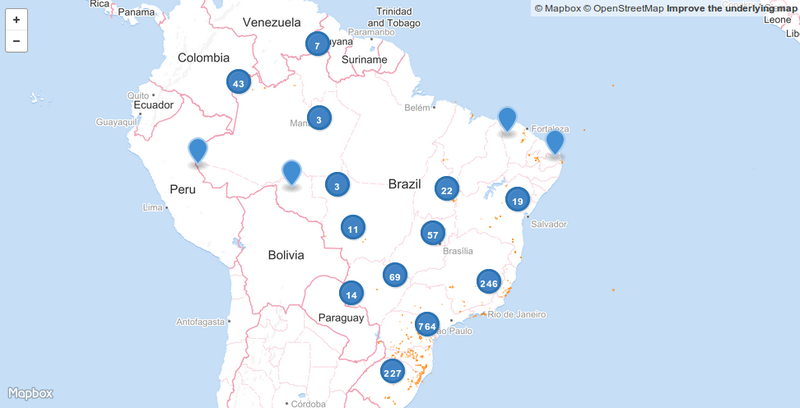

## Cachoeiras e quedas-d'águas do Brasil

Como é possível preservar cachoeiras se não sabemos onde elas estão? Não é difícil imaginar que muitas já desapareceram devido a fiscalização precária e descaso com o meio ambiente. Este repositório reune dados produzidos colaborativamente sobre a localização de cachoeiras e quedas d'águas do Brasil presentes na base de dados do [OpenStreetMap](www.openstreetmap.org).

O mapa abaixo (de fevereiro de 2016) mostra que a maior parte do mapeamento está no sudeste e sul do país, e que ainda falta muito a ser mapeado. Para participar, crie uma conta no OpenStreetMap e adicione nós com a etiqueta `waterway=waterfall`. No [guia de mapeamento](http://wiki.openstreetmap.org/wiki/Waterfalls) no [wiki](wiki.openstreetmap.org) do [OpenStreetMap](www.openstreetmap.org) há mais detalhes.


<a href="https://github.com/vgeorge/cachoeiras/blob/master/quedas-dagua-2016-02-10.geojson" target="_blank">

</a>

Baixe os dados:

* [ quedas-dagua-2016-02-10.geojson](https://github.com/vgeorge/cachoeiras/raw/master/quedas-dagua-2016-02-10.geojson)

### Obtendo dados atualizados

O [Overpass](http://overpass-turbo.eu) é uma [API de busca de dados do OpenStreetMap](http://wiki.openstreetmap.org/wiki/Overpass_API). Execute esta [consulta do Overpass](http://overpass-turbo.eu/s/ekI) para obter informações atualizadas sobre cachoeiras e outras quedas-d'água:

```
[out:json];
{{geocodeArea:brazil}}->.searchArea;
(
  way["natural"="cliff"](area.searchArea);
  node["waterway"="waterfall"](area.searchArea);
);
out body;
>;
out skel qt;
```

## Licença

Estes dados estão sob a *Open Database License (ODbL)*, consulte os [termos de uso](http://www.openstreetmap.org/copyright) no site do [OpenStreetMap](www.openstreetmap.org).
