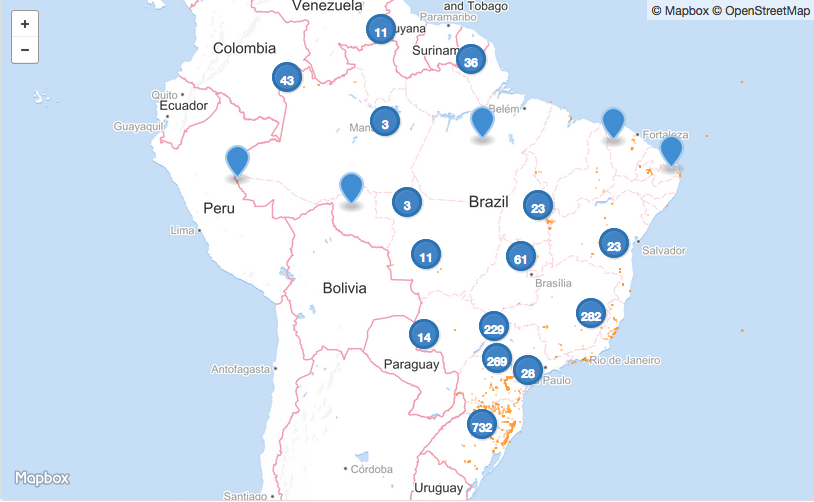

## Cachoeiras do Brasil

Um mapa de cachoeiras e quedas-d'água do Brasil, baseado no [OpenStreetMap](www.openstreetmap.org). Clique na imagem para navegar:

<a href="https://github.com/vgeorge/cachoeiras/blob/master/quedas-dagua-2016-02-10.geojson" target="_blank">

</a>

Última atualização: 31 de outubro de 2016

### Como mapear

Crie uma conta no OpenStreetMap e adicione nós com a etiqueta `waterway=waterfall`. No [guia de mapeamento](http://wiki.openstreetmap.org/wiki/Waterfalls) no [wiki](wiki.openstreetmap.org) do [OpenStreetMap](www.openstreetmap.org) há mais detalhes.

### Obtendo dados atualizados

O [Overpass](http://overpass-turbo.eu) é uma [API de busca de dados do OpenStreetMap](http://wiki.openstreetmap.org/wiki/Overpass_API). Execute esta [consulta do Overpass](http://overpass-turbo.eu/s/ekI) para obter informações atualizadas sobre cachoeiras e outras quedas-d'água:

```
[out:json];
{{geocodeArea:brazil}}->.searchArea;
(
  way["natural"="cliff"](area.searchArea);
  node["waterway"="waterfall"](area.searchArea);
);
out body;
>;
out skel qt;
```

## Licença

Estes dados estão sob a *Open Database License (ODbL)*, consulte os [termos de uso](http://www.openstreetmap.org/copyright) no site do [OpenStreetMap](www.openstreetmap.org).
